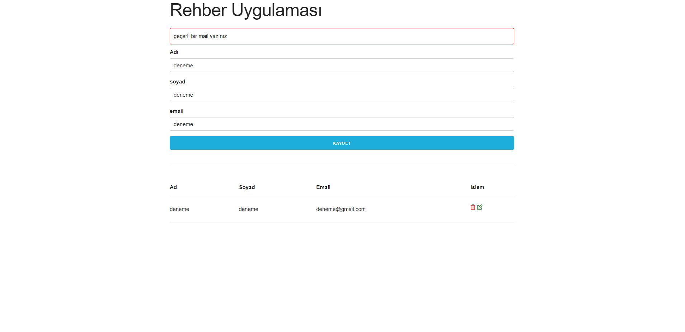
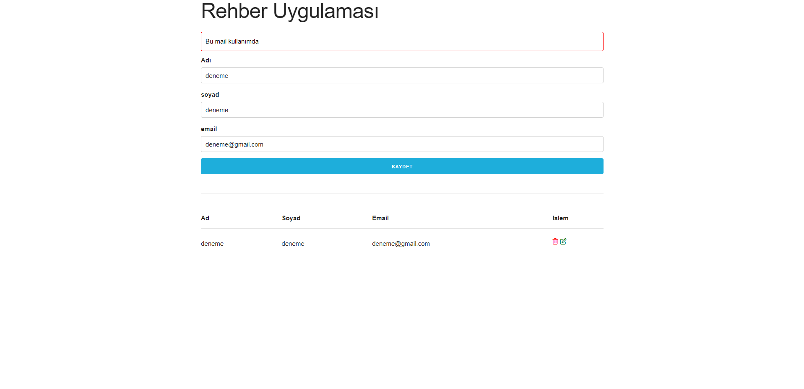
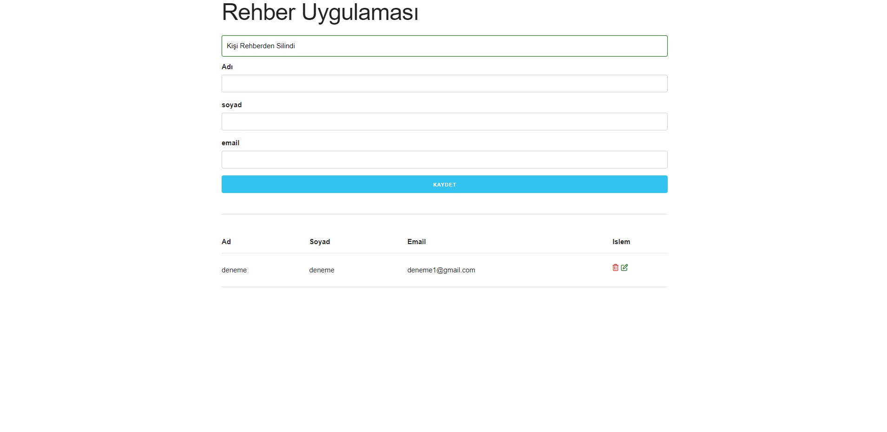
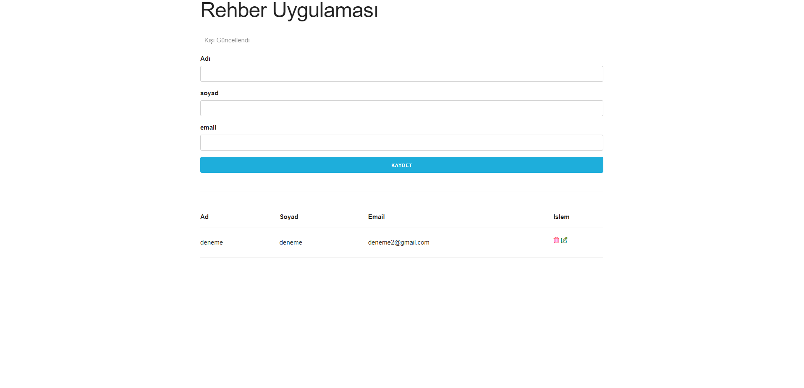

# Kullanıcıları Uygulamaya Kaydetme ve Listeleme

### Kullanıcı Ad, Soyad, Mail bilgilerini aldıktan sonra "Local Storage" kısmına kaydetme, listeleme, listeden kayıt silme, listeye kayıt ekleme ve listede ki kayıtları güncelleme işlemleri sunar. Mail kısmı Uniq olarak ayarlanmıştır.

## Mail Adresinin geçerli olması gerekir.

 

## Mail Uniq olarak ayarlanmıştır.

## Rehberden kişi silme işlemi.

## Rehberde ki kişiyi güncelleme işlemi.

